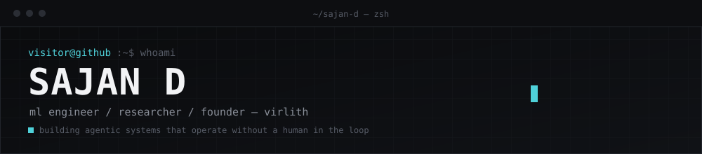

<div align="center">



<br/><br/>

<a href="https://www.linkedin.com/in/sajand-ai/">linkedin</a> ·
<a href="mailto:sajandevep@gmail.com">email</a> ·
<a href="https://github.com/SAJANCODER">github</a> ·
<a href="https://drive.google.com/file/d/1_4oorwsadKRCLhmMWFx5ZKK0yEo8SOH3/view?usp=sharing">resume</a>

</div>

<br/>

```
belief   → the future isn't a destination we wait for. it's a system we architect.
focus    → high-integrity agentic workflows, bridging static code and autonomous intelligence
currently→ closing the gap between deterministic systems and probabilistic ones, one agent at a time
```

<br/>

### now building

| | |
|---|---|
| **QUBREA** — git intelligence agent | autonomous bridge between repository events and real-time intelligence feeds. repo activity becomes live signal. `python` `telegram-api` `autonomous-agents` |
| **prompt-architect** — reasoning framework | systematic generation of high-precision structured prompts for consistent, optimized LLM reasoning. `generative-ai` `prompt-engineering` `llm` |
| **isl recognition** — sign language pipeline | GNN-based gesture extraction with real-time sign-to-text translation. `tensorflow` `gnns` `computer-vision` |

<br/>

### stack

```
languages       python · java
ml / research   pytorch · tensorflow · gnns · scikit-learn
infra           nvidia cuda · azure · google cloud · docker
interface       react · fastapi · figma
```

<br/>

### activity

<div align="center">


</div>

<div align="center">

</div>

<br/>

<div align="center">
<sub>sajan d · virlith systems</sub>
</div>